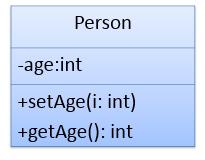

# 封装(Encapsulation)


- 信息封装和隐藏的必要性
- private 关键字

我们日常使用的电脑主机，把cpu、内存、主板等等都封装到机箱里面去。假如没有机箱的话的出现什么问题，主机、主板全部都散落在一处，然后开机没有开机按钮，那么需要我们直接操作接跳线才能把电脑开启。这样子的话假如操作不慎的话，会让机器损坏危险,那么假如用机箱封装起来的话，那么就不需要这样子做了。体现了封装性


使用者对类内部定义的属性(对象的成员变量)的直接操作会导致数据的错误、混乱或安全性问题。

 封装从**字面上**来理解就是包装的意思，专业点就是信息隐藏，是指利用抽象数据类型将数据和基于数据的操作封装在一起，使其构成一个不可分割的**独立实体**，数据被保护在抽象数据类型的内部，尽可能地隐藏内部的细节，只保留一些对外方法使之与外部发生联系。

举例: 

- 访问和操作圆的半径 
- 手表的操作
- 一个人的姓名、性别、年龄、妻子都是这个人的私有属性

#  概念

**封装**是把过程和数据包围起来，对数据的访问只能通过已定义的方法。 面向对象计算始于这个基本概念，即现实世界可以被描绘成一系列完全自治、**封装**的对象，这些对象通过一个受保护的接口访问其他对象。 **封装**是一种信息隐藏技术，在**java**中通过关键字private，protected和public实现**封装**。目前知识只涉及到private和public

private 修饰的成员，只能在当前类中访问;而 public 修饰的成员，在其他类中可以访问


Java中通过将数据声明为私有的(private)，再提供公开的（public）方法:getXXX和setXXX实现对该属性的操作，以实现下述目的：

- 隐藏一个类的实现细节
- 使用者只能通过事先定制好的方法来访问数据，可以方便地加入控制逻辑，限制对属性的不合理操作；
- 便于修改，增强代码的可维护性；

```Java
public class Animal{
    private int legs;       //将属性legs定义为private，只能被Animal类内部访问
    public void setLegs(int i){  //在这里定义方法 eat() 和 move() 
        if (i != 0 && i != 2 && i != 4){
             System.out.println("Wrong number of legs!");
             return;
        }
        legs=i;
    }
    public int getLegs(){
        return legs;
        }
    }
    class Zoo{
        public static void main(String args[]){
            Animal xb=new Animal();
            xb.setLegs(4);   //xb.setLegs(-1000);       
                     xb.legs=-1000;   //非法
            System.out.println(xb.getLegs());
        }
    }
}
```

需 求 ： 

使 用 java类 描 述 百 合 网 的 会 员 。 

 

封 装 的 好 处 ： 

1. 提 高 数 据 的 安 全 性
2. 良好的封装能够减少耦合
3. 类内部的结构可以自由修改
4. 可以对成员变量进行更精确的控制
5. 隐藏信息，实现细节

# 练习

创建程序,在其中定义两个类，Person和TestPerson类的定义如下。



用setAge()设置人的合法年龄(0~130)，用getAge()返回人的年龄。在Test类中实例化Person类的对象b，调用setAge()和getAge()方法，体会Java的封装性。

# 标准Java Bean

1. 是一个java类
2. 成员变量都是私有的
3. 成员方法者是公有的
4. 成员方法分为getter和setter方法 getter方法为获得成员变量值的方法,而setter方法为设置成员变量的方法
5. getter和setter方法名称根据成员变量名称来生成,格式固定 如成员变量叫 xyz => getXyz和setXyz(xyz)

 

注意: boolean类型比较特殊 

# 作业

1. 什么是封装
2. 封装有哪些优点
3. 什么是IDE开发工具，常见的JAVA开发工具有哪些
4. 什么是标准的JAVA Bean
5. 如何使用idea快速生成getter/setter方法